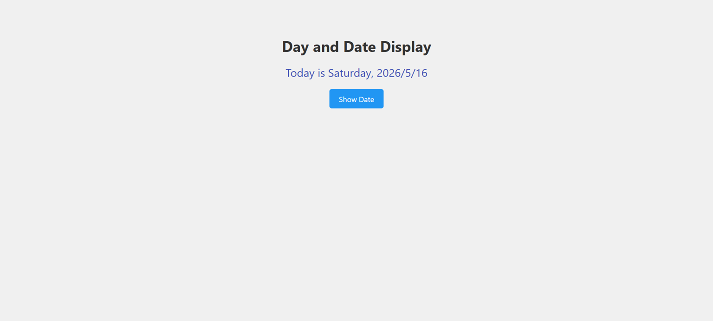

# Day and Date

A web application that displays the current Gregorian date and the corresponding day of the week.

## Features
- Day of the week display.
- Current Gregorian date (Year/Month/Day).
- Interactive button to trigger the display.
- Simple and clean user interface.

## Technologies Used
- HTML5
- CSS3
- JavaScript (Vanilla JS)

## How to Run
1. Clone the repository or download the source files.
2. Open `index.html` in any modern web browser.
3. Click the "Show Date" button.
